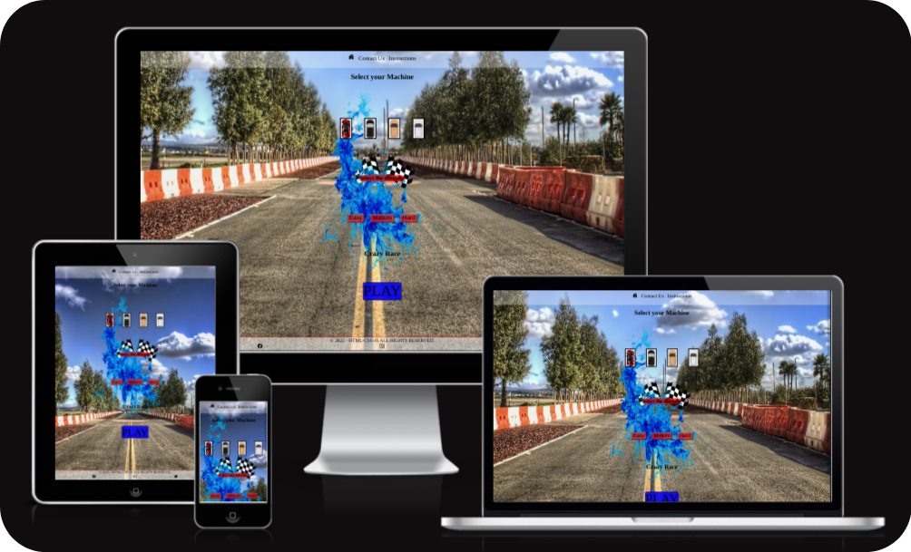
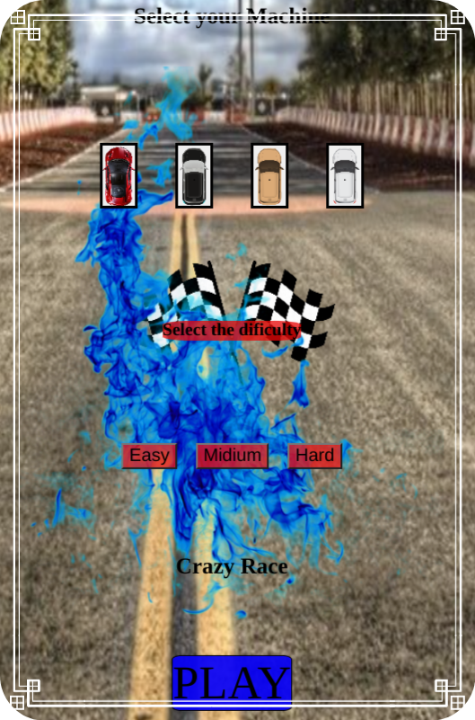
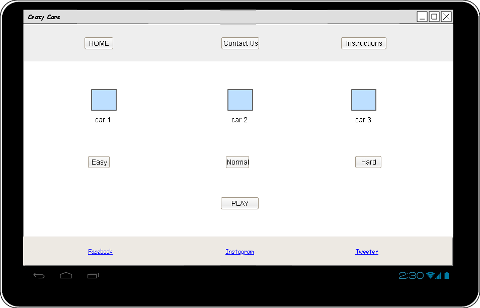
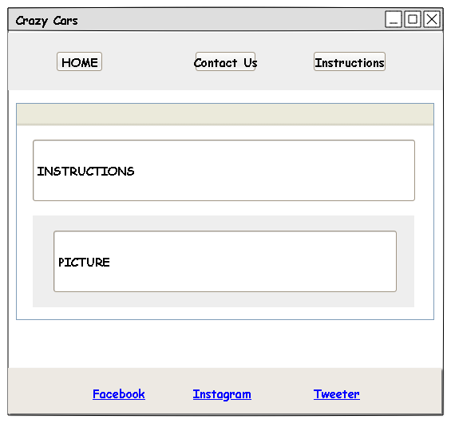

# __CI_PP2_CG__


Code institute Project portfolio 2 Cars Game **CI_PP2_CG** Is a web page developed to be a Retro car game by using of different methods and technics, like animations in CSS and algorithms in JS to make it interactive.

 

- HTML 
"HTML is the standard markup language for documents designed to be displayed in a web browser. It can be assisted by technologies such as Cascading Style Sheets (CSS) and scripting languages such as JavaScript. [[1](https://en.wikipedia.org/wiki/HTML)] "

- CSS
"Cascading Style Sheets (CSS) is a style sheet language used for describing the presentation of a document written in a markup language such as HTML.
CSS is a cornerstone technology of the World Wide Web, alongside HTML and JavaScript.[[2](https://en.wikipedia.org/wiki/CSS)]"

- JS
"JavaScript, often abbreviated JS, is a programming language that is one of the core technologies of the World Wide Web, alongside HTML and CSS. As of 2022, 98% of websites use JavaScript on the client side for web page behavior, often incorporating third-party libraries. All major web browsers have a dedicated JavaScript engine to execute the code on users' devices. .[[3](https://es.wikipedia.org/wiki/JavaScript)]"

   


[Live web page](https://jdhernandezs1.github.io/CI_PP2_CG/)


## __Table of Content__

1. [Project Goals](#project-goals)
    1. [User Goals](#user-goals)
    2. [Site Owner Goals](#site-owner-goals)
2. [User Experience](#user-experience)
    1. [Target Audience](#target-audience)
    2. [User Requirements and Expectations](#user-requirements-and-expectations)
    3. [User Stories](#user-stories)
3. [Design](#design)
    1. [Design Choices](#design-choices)
    2. [Colour](#colour)
    3. [Fonts](#fonts)
    4. [Structure](#structure)
4. [Technologies Used](#technologies-used)
    1. [Languages](#languages)
    2. [Frameworks Libraries Tools](#frameworks-libraries-tools)
5. [Features](#features)
6. [Testing](#validation)
    1. [HTML Validation](#html-validation)
    2. [CSS Validation](#css-validation)
    3. [Accessibility](#accessibility)
    4. [Performance](#performance)
    5. [Browsers support](#browsers-support)
    6. [Testing user stories](#testing-user-stories)
8. [Bugs](#bugs)
9. [Deployment](#deployment)
10. [Credits](#credits)
11. [Contributing](#contributing)
12. [License](#license)
13. [Acknowledgements](#acknowledgements)

## __Project Goals__

### __User Goals__

- Look for a free vintage game.
- Look for a straightforward website.
- Enjoy a straightforward game.
- Score some points.
- A brief guide explaining how to play the game.

### __Site Owner Goals__

- Create a straightforward, time-tested game to showcase some abilities.
- Offer a manual or instructions on how to play the game.
- Design a game that includes a navigation bar and feedback.

## __User Experience (UXD)__

### __Target Audience__

- The general public.
- People looking to play a free classic game.
- Kids.

### __User Requirements and Expectations__

- Responsive interactive page design.
- A page with simple and straightforward navigation.
- Instructions are provided with clear information.
- Social media and links also function.
- A responsive layout that functions on various screens. 

### __User Stories__

#### __First-time User__
First time user:

1. Desires simple navigation.
2. Is interested in playing.
3. Desires to play a traditional game.
4. Desires to solicit comments or opinions.
5. Is curious about social media.
6. Be familiar with the game's rules 

#### __Returning User__
As a returning user, We want:

7. be aware of the result and improve.
8. A website where you may unwind and play a simple game.
9. Offer feedback or file bug reports.
10. Locate the page's social media accounts.
11. Use a website with a straightforward navigation bar.

#### __Site Owner__
As the site owner, we want:

12. Participants who enjoy the game.
13. A responsive and interactive page that is clear.
14. Simple method for contacting us and providing feedback.
15. Give the players a sense of being in a traditional setting.

## __Design__

### __Design Choices__
The game was created with the intention of evoking memories of vintage 16-pixel games and was heavily influenced by its vintage user interface.

### __Colour__

Using the Visual Studio colors setting, the color tones were specifically selected to match the concept and to a straightforward and approachable style.

  

<br>

### __Fonts__

Was searched for a friendly font and came upon ROBOTO from GOOGLE, which has been utilized in smartphones.
The most common font used on those platforms, which account for the majority of data flow, was used.
<br>

### __Structure__

Following the principles of UXD (user experience design), the page's structure was made to be fluid and simple to read. To determine the sort of design used in contemporary food pages, research was conducted at the most well-liked Classic games.
the following hues associated with the theme (Classic Car game)

The website was composed of five pages: 

- The home page, which includes the primary article, contact information, and social media links.
- Game page where the interactive platform that interacts with the main page is located and where the level and vehicle are chosen.
- The game's instructions page, which enables visitors to play, sadly does not work for blind persons.
- A 404 page, which is created for every broken link, prompts the user to rewrite the page.
- The page with the active form is called "Contact Us," and it provides information to us via email so we may read reviews and make improvements to the website.

### Wireframes

<details><summary>Home</summary>
    <details><summary>PC view</summary>
    
    </details>
    <details><summary>Tablet view</summary>
    
    </details>
    <details><summary>Phone view</summary>
    
    </details>
</details>

<details><summary>Contact Us</summary>
    <details><summary>PC view</summary>
    
    </details>
    <details><summary>Tablet view</summary>
    
    </details>
    <details><summary>Phone view</summary>
    
    </details>    
</details>

<details><summary>Instructions</summary>
    <details><summary>PC view</summary>
    
    </details>
    <details><summary>Tablet view</summary>
    
    </details>
    <details><summary>Phone view</summary>
    
    </details>    
</details>

<details><summary>Game</summary>
    <details><summary>PC view</summary>
    
    </details>
    <details><summary>Tablet view</summary>
    
    </details>
    <details><summary>Phone view</summary>
    
    </details>    
</details>

<details><summary>404</summary>
    <details><summary>PC view</summary>
    
    </details>
    <details><summary>Tablet view</summary>
    
    </details>
    <details><summary>Phone view</summary>
    
    </details>    
</details>


## __Technologies Used__

### __Languages__

- HTML5
- CSS
- Java Script

### __Frameworks Libraries Tools__

- Visual Studio Code
- Git
- GitHub
- Gitpod
- Balsamiq
- Google Fonts
- W3schools Colors
- Favicon.io
- ion icons

## __Features__

### __Navigation Bar__

Three HTML components make up the section. The first is the home page, where the user made the decision to play or read the content, the second is the contact us page, where the user can write us with their thoughts by email, and the third is the page with the instructions.
- User stories covered: 

  

### __Main page__

The page was created and influenced by old-school user interface (UI) games, where colors were blended and changed periodically to try to give users a sense of being in an antiquated setting while using contemporary visuals.
- User stories covered: 

  
<!-- aca voy -->
### __Form Design__
the next section reports about how the meat production destroy the environment and some illneses
third is the contact with us to know about the client and how they felt.
in a relaxing design to dont disturb the writer in where the user can feel quiet to express the ideas.  
- User stories covered: 9


### __Footer__

the footer was created to be fluid with the other colors and share some social medias about by the restaurant.
the proyect was developed in HTML & CSS using visual studio code, the code was tested with W3C
every single html file is divided in sections where you have wrappers to be organized and easy future changes. 
- User stories covered: 10

  

### __Responsive Design__

Was modified and adapted to the Iphone 5 screen  
you can apreciate how looks in the picture  
- User stories covered: 6

 

### __Menu__

Simply and easy use page with the most important indicators like description buttom to buy title and a picture where the clients can know what they will eat
- User stories covered: 8

 

### __Video__

The video used for the curious clients who want to know more about the diet 
- User stories covered: 1


### __Map and location__

The google map location and phone to contact us.
- User stories covered: 12

 

## __Validation__

### __HTML Validation__

The Validator used was W3C Service to validate the HTML of the webpage, 
the entire project pass with no errors and warning by use of some tools.

<details><summary>Home Validation</summary>

</details>
<details><summary>Benefits Validation</summary>

</details>
<details><summary>Contact Us Validation</summary>

</details>
<details><summary>Menu Validation</summary>

</details>
<details><summary>404 Validation</summary>

</details>

### __CSS Validation__

W3C's primary activity is to develop protocols and guidelines that guarantee long-term growth for the Web.
W3C's  determine key parts of what makes the World Wide Web activity.
W3C was used to validate the CSS style of the whole page

<details><summary>style.css</summary>

</details>

### __Accessibility__

The WAVE WebAIM web accessibility evaluation tool was used to ensure the website met high accessibility standards. All pages pass with 0 errors.

<details><summary>Home accessibility</summary>

</details>
<details><summary>Benefits accessibility</summary>

</details>
<details><summary>Contact Us accessibility</summary>

</details>
<details><summary>Menu accessibility</summary>

</details>
<details><summary>404 accessibility</summary>

</details>

### __Performance__

 The performance test of the website was make by Google Lighthouse in Google Chrome Developer Tools: 

<details><summary>Home performance</summary>

</details>
<details><summary>Benefits performance</summary>

</details>
<details><summary>Contact Us performance</summary>

</details>
<details><summary>Menu performance</summary>

</details>
<details><summary>404 performance</summary>

</details>

### __Browsers support__

| [](http://godban.github.io/browsers-support-badges/)<br/>IE / Edge | [](http://godban.github.io/browsers-support-badges/)<br/>Firefox | [](http://godban.github.io/browsers-support-badges/)<br/>Chrome | [](http://godban.github.io/browsers-support-badges/)<br/>Safari | [](http://godban.github.io/browsers-support-badges/)<br/>Opera |
| --------- | --------- | --------- | --------- | --------- |
| IE11, Edge| last 2 versions| last 2 versions| last 2 versions| last 2 versions

### __Testing user stories__


1. wants to know more about the vegetarian diet.

| **Feature** | **Action** | **Expected Result** | **Actual Result** |
|-------------|------------|---------------------|-------------------|
| Basic information| Text with that| Text and graphics | Works as well |
<details><summary>Basic_information</summary>

</details>

2. wants to know the prices, ingredients and meals variety.

| **Feature** | **Action** | **Expected Result** | **Actual Result** |
|-------------|------------|---------------------|-------------------|
| Menu structure | Navigate to menu page, locate the menu | Table with the menu options | Works as well |
| Items with information price and option to buy| Explore the menu | Items with description price and buy button | Works as well |

<details><summary>Menu page</summary>

</details>
<details><summary>Menu items</summary>

</details>

3. wants to know where the restaurant is located and what the contact is for delivery and reservations.

| **Feature** | **Action** | **Expected Result** | **Actual Result** |
|-------------|------------|---------------------|-------------------|
| Location and address| Navigate to Contact US page, Locate the info | Map and address | Works as well |

<details><summary>MAP and Address</summary>

</details>

4. wants to let feedback for improving the place that they look for.

| **Feature** | **Action** | **Expected Result** | **Actual Result** |
|-------------|------------|---------------------|-------------------|
| Feedback Form| Form to submit their opinion | Form | Works as well |
| Form structure | Name, date and opinion | Fill areas | Works as well |
<details><summary>Form</summary>

</details>

5. wants to know more information about the vegetarian diet.

| **Feature** | **Action** | **Expected Result** | **Actual Result** |
|-------------|------------|---------------------|-------------------|
| Text and Picture with more information| Text Listed with pictures | Fluid design | Works as well |

<details><summary>Information Listed</summary>

</details>


6. Find a responsive design like phone user.

| **Feature** | **Action** | **Expected Result** | **Actual Result** |
|-------------|------------|---------------------|-------------------|
|Responsive page| Adapt to different screen | Good visualization | Works as well |

<details><summary>Visualization</summary>

</details>

7. Find a place who give information about the food that they provide.


| **Feature** | **Action** | **Expected Result** | **Actual Result** |
|-------------|------------|---------------------|-------------------|
|Section adapted to show chemical details| mix images and text in list| Good images size and list good adapted | Works as well |

<details><summary>Details Section</summary>

</details>

8. Show prices in the menu.


| **Feature** | **Action** | **Expected Result** | **Actual Result** |
|-------------|------------|---------------------|-------------------|
|Good position of the price in the product| Put the price in the correct side| User easy view | Works as well |

<details><summary>Menu And price</summary>

</details>

9. leave feedback about how they felt and what the place can improve.

| **Feature** | **Action** | **Expected Result** | **Actual Result** |
|-------------|------------|---------------------|-------------------|
| Checkbox Questionare | Give options to measure level of experience | Checkbox | Works as well |
<details><summary>Questionare</summary>

</details>

10. Find the social media of the restaurant. 

| **Feature** | **Action** | **Expected Result** | **Actual Result** |
|-------------|------------|---------------------|-------------------|
| Social media buttons | Open it on blank page | button Link | Works as well |
<details><summary>Social media</summary>

</details>

11. Navigate in an easy site with a simple navigation bar.

| **Feature** | **Action** | **Expected Result** | **Actual Result** |
|-------------|------------|---------------------|-------------------|
| Nav bar with mark of view | Border to show where you are | Border color | Works as well |
<details><summary>Fluid Nav Bar </summary>

</details>

12. Know the location of the restaurant.

| **Feature** | **Action** | **Expected Result** | **Actual Result** |
|-------------|------------|---------------------|-------------------|
| Restaurant Location| Navigate to Contact US page, Locate the info | Map | Works as well |
| Restaurant information | Find the information | Phone and direction | Works as well |

<details><summary>Contact Us</summary>

</details>
<details><summary>Restaurant Information</summary>

</details>
<details><summary>MAP</summary>

</details>

13. Know the benefits of the Diet.

| **Feature** | **Action** | **Expected Result** | **Actual Result** |
|-------------|------------|---------------------|-------------------|
| Benefits Information | Navigate to benefit page, locate the Information | Text with the information that they are interesting | Works as well |
| Video shared to complete the information | Go to the end to find it | Find a video where the client can learn more about the diet | Works as well |
<details><summary>Benefits Page</summary>

</details>
<details><summary>Information</summary>

</details>
<details><summary>Video</summary>

</details>

14. Clients who are searching change to a new diet and be healthy.

| **Feature** | **Action** | **Expected Result** | **Actual Result** |
|-------------|------------|---------------------|-------------------|
| Diet Information | Home page locate the Information | Text with the information and a picture with t | Works as well |
| Video shared to complete the information | Go to the end to find it | Find a video where the client can learn more about the diet | Works as well |
<details><summary>Benefits Page</summary>

</details>

15. Clear page where the client can buy easy.

| **Feature** | **Action** | **Expected Result** | **Actual Result** |
|-------------|------------|---------------------|-------------------|
| Buttom to buy | Buy items | Buy easy and semply | Works as well |

<details><summary>Buy buttom</summary>

</details>


16. Easy way to contact the restaurant.

| **Feature** | **Action** | **Expected Result** | **Actual Result** |
|-------------|------------|---------------------|-------------------|
| Section mixing information and the other topics | structure where integrate three user stories | Good, easy and structured | Works as well |

<details><summary>Structure</summary>

</details>


17. Make feel the clients a place who care about them.

| **Feature** | **Action** | **Expected Result** | **Actual Result** |
|-------------|------------|---------------------|-------------------|
| Friendly structure | Image with feelings and text aproching | Client feel as well | Works as well |

<details><summary>Friendly section</summary>

</details>


## __Bugs__

| **Bug** | **Fix** |
| ----------- | ----------- |
| Superposition | up priority of z-index |
|short Screen size items | Set a % size |

## __Deployment__

### Share the code

The deployement of the website was by using GitHub Pages following the steps:

1. In the settings of repository in GITHUB page.
2. On the menu in the section code and automation, Pages.
3. Select main branch in the selector in source.
4. If all before was did as well you can see Your site is published with your "url"

### Fork the code

To fork the repository:

1. On the GitHub repository.
2. Press Fork button in right upper at hand corner.

### Clone the code

To clone the repository:
- In the Github repository
1. Locate the button __Code__ in the right uper corner. 
2. Chose between HTTPS, SSH, Github CLI or download zip.
3. Open Git Terminal (Bash).
4. Go to the directory where you want to cloned the file.
6. Use command Git clone and paste the URL.
```bash
git clone https://github.com/jdhernandezS1/CI_PP1_HB.git
```   
Online view [link_to_page](https://jdhernandezs1.github.io/CI_PP1_HB/index.html)
## __Credits__

- Google apis for fonts and maps : fonts.googleapis.com
- icons source : https://ionic.io/ionicons
- https://www.w3schools.com  
### __Media__
Images Sources:
- shutterstock
- inspirulina
- buzzfeed
- funfoodfrolic
- tesco
- recipetineats
- meredithcorp
- independent
- budgetbytes
- immediate

### __Information__
- vegetarian cooking by Jerónimo Yagüe Calvo 2006. 

### __Code__
In order how was used:

- GITHUB to create the repository.
- Visual Studio Code by develop the HTML, CSS and Code 404 Page.


#### __Built With__

The softwares language and recomended IDE used to build the project.

* [HTML](https://www.w3schools.com/html/)
* [CSS](https://www.w3schools.com/css/default.asp)	
* [visual studio code](https://visualstudio.microsoft.com/es/)
* [Git](https://git-scm.com/)
* [GitHub](https://github.com/)


## __Contributing__

Please read through our contributing guidelines, every pull request has been notified to be able to push code included 
- directions for opening issues
- coding standards
- notes on development
## __License__

- CI_PP1_HB is an open source project by [CI_PP1_HB](https://github.com/jdhernandezS1/CI_PP1_HB) that is licensed under [ops](https://opensource.org/).
- CI_PP1_HB reserves the right to change the license of future releases.

## __Acknowledgements__

Cordially thanks to: 

- HashEm to bless me.
- My mentor Mo Shami for his support and Professional advices.
- My Family to support me.
